# Project 2 - LEMP Stack Implementation
___
___
### **Step 1 Installing the Nginx Web Server**
___
>#### Installing Nginx using Ubuntu’s package manager ‘apt’

#####  To update a list of packages in package manager *`sudo apt update`* command is used and *`sudo apt install nginx`* command is used to install the Nginx Web Server.
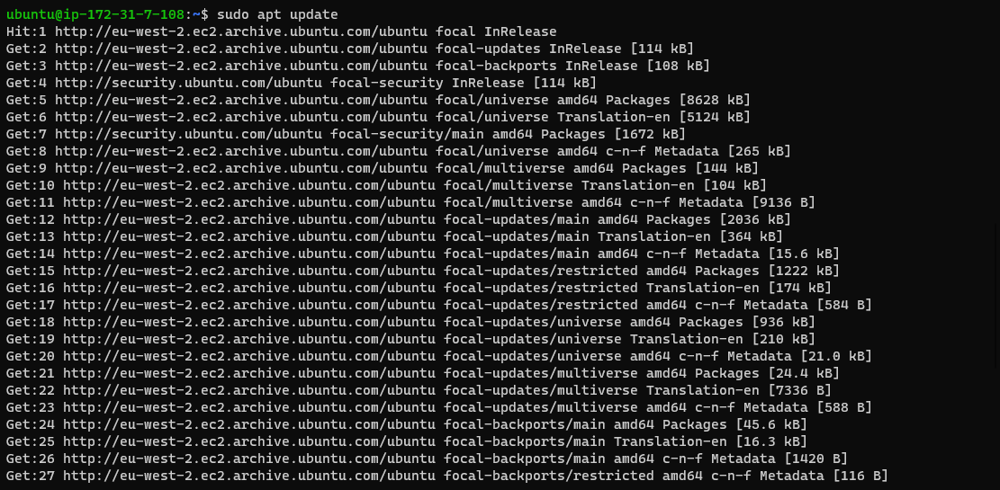

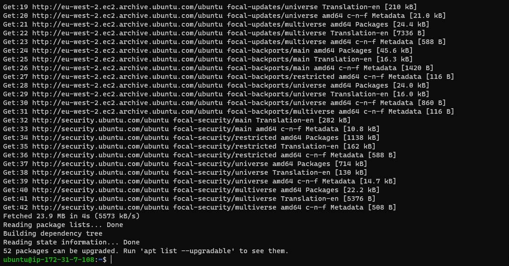
>#### Installing nginx Package 

#####  To install the nginx package *`sudo apt install nginx`* command is used and below images shows the status of the running update.
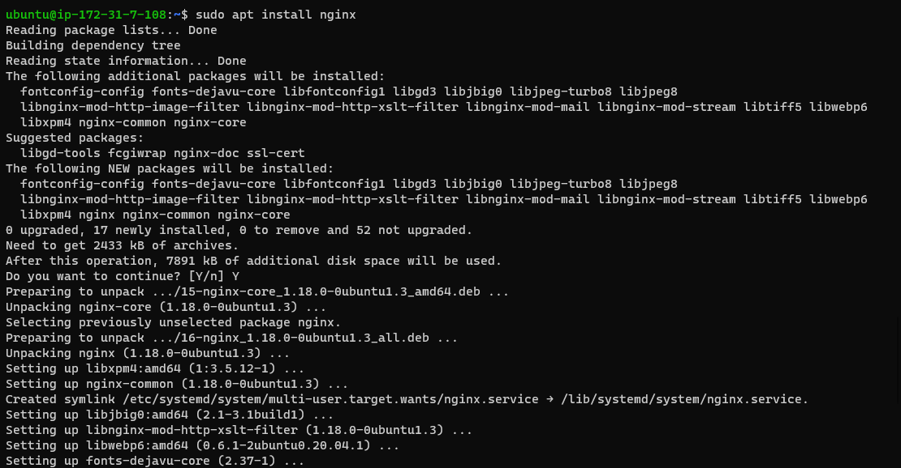
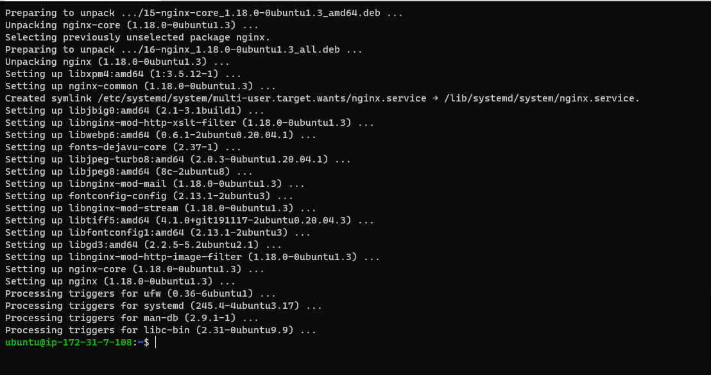
#####  The below image verifies that nginx is running as a Service on Ubuntu using command *`sudo systemctl status nginx`*
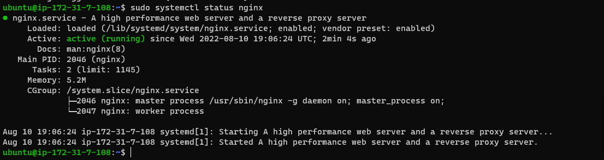
>#### Testing the Newly Launch Nginx  server

#####  To Acces the Nginx Server  *`curl`* command can be used or through the CLI or a web browser by using the public IP address of the server. Below Inage shows the server page via the web browser.
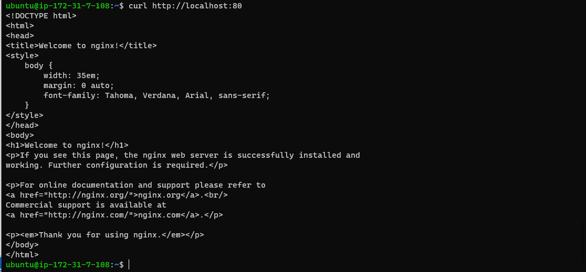

### **Step 2 INSTALLING MYSQL**
___

>#### Acquiring & Installing mysql server  using ‘apt’
#####  To install the mysql *`sudo apt install mysql-server`* command is used and below images shows the status of the running update.
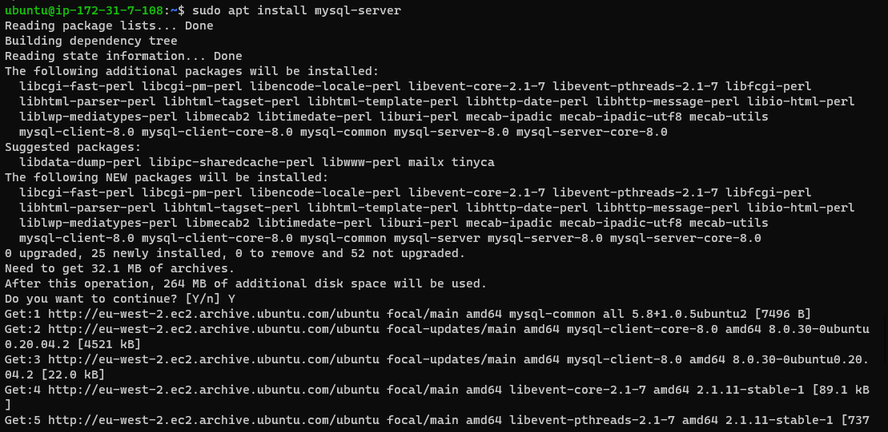
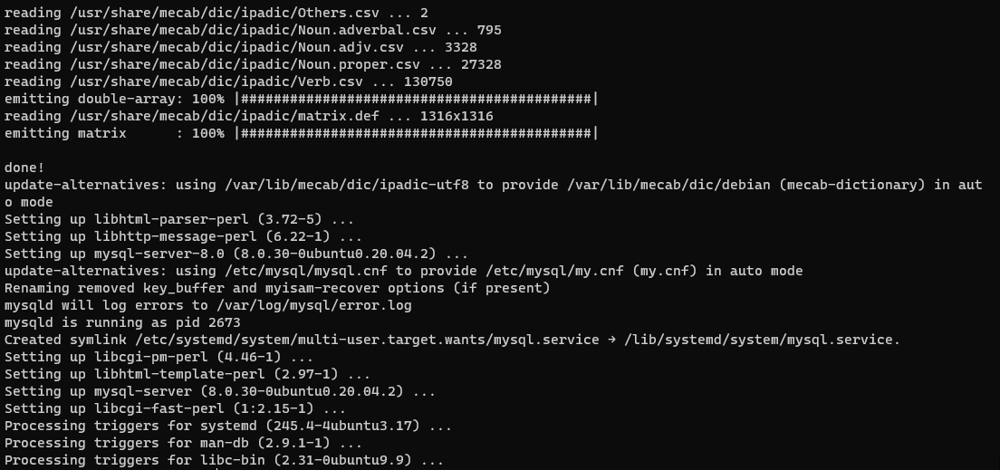
#####  To logon to mysql console *`sudo mysql`* command is used also mysql root user password is altered with *`ALTER USER 'root'@'localhost' IDENTIFIED WITH mysql_native_password BY 'PassWord.1';`* command.
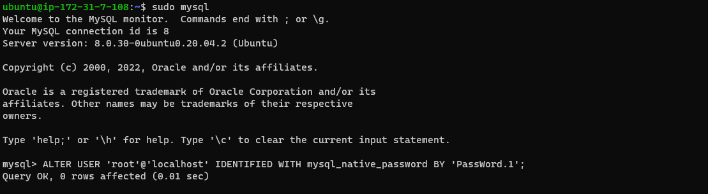
#####  To setup a secure  mysql console *`sudo mysql_secure_installation`* command is used and below images shows output of the command
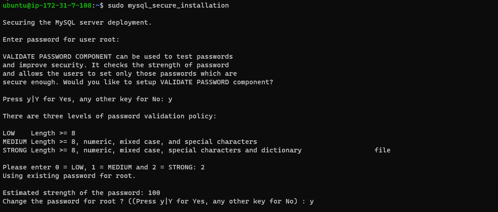
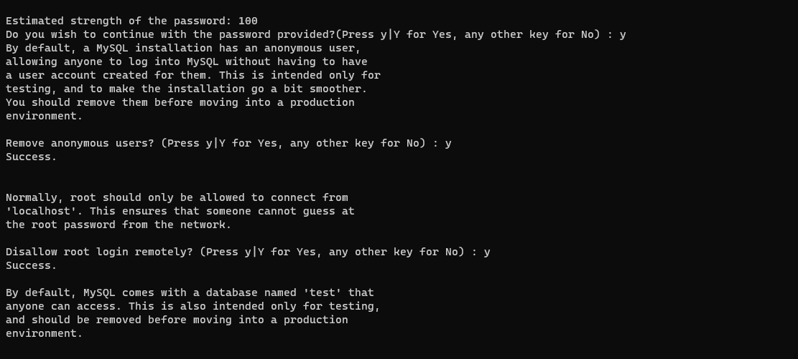
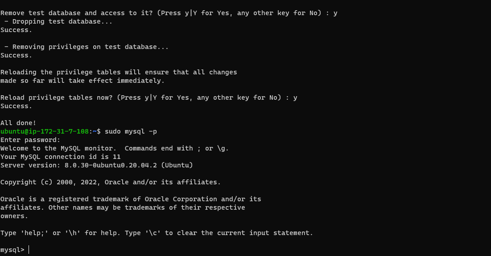
### **Step 3 INSTALLING PHP**
___
>#### To have the PHP running Nginx requires an external program.
* PHP fastCGI process manager - *`php-fpm`* it bridge between the PHP interpreter itself and the web server need to be run;
* *`php-mysql`*- PHP module that allows PHP to communicate with MySQL-based databases as well. 
#####  To install all this 2 packages and other core php packages *`sudo apt install php-fpm php-mysql`* command is used and below images shows the status of the running update.
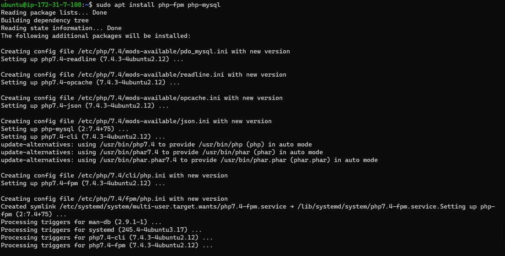